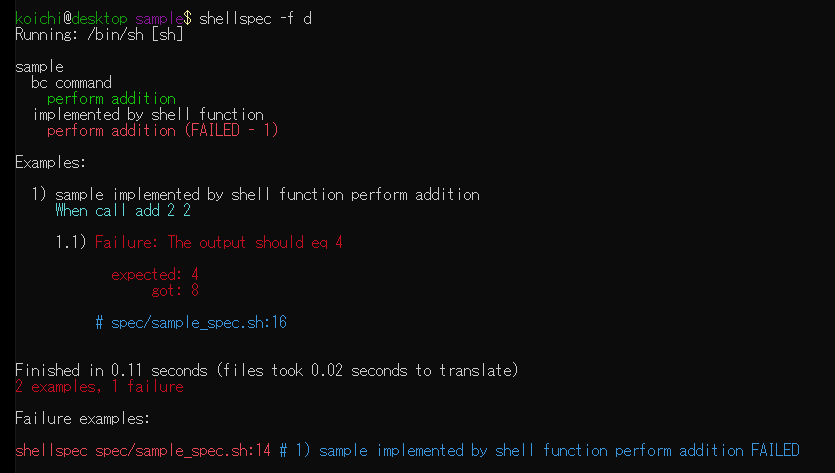

# shellspec

BDD based testing framework for POSIX compatible shell scripts.

[](https://travis-ci.org/ko1nksm/shellspec)



*Table of Contents*

- [Introduction](#introduction)
  - [Specfile syntax](#specfile-syntax)
  - [Features](#features)
  - [Supported shells](#supported-shells)
  - [Dependency](#dependency)
- [Tutorial](#tutorial)
  - [Installation](#installation)
  - [Getting started](#getting-started)
  - [Samples](#samples)
- [Basic structure](#basic-structure)
  - [Nestable groups and scope](#nestable-groups-and-scope)
  - [Temporarily skip block](#temporarily-skip-block)
  - [Hooks](#hooks)
  - [Mock and Stub](#mock-and-stub)
- [Example](#example)
  - [Evaluation](#evaluation)
  - [Expectation](#expectation)
    - [The statement](#the-statement)
    - [It statement](#it-statement)
    - [Language chains](#language-chains)
  - [Subject](#subject)
  - [Modifier](#modifier)
  - [Matcher](#matcher)
  - [Helper](#helper)
    - [Path alias](#path-alias)
  - [Skip and Pending](#skip-and-pending)
- [shellspec command](#shellspec-command)
  - [Configure default options](#configure-default-options)
  - [Task runner](#task-runner)
  - [Envronment](#envronment)
  - [Special files / directories with in spec directory](#special-files--directories-with-in-spec-directory)
    - [spec/spec_helper.sh](#specspechelpersh)
    - [spec/support/](#specsupport)
    - [spec/banner](#specbanner)

## Introduction

### Specfile syntax

```sh
Describe 'sample' # Example group block
  Describe 'bc command'
    add() { echo "$1 + $2" | bc; }

    Example 'perform addition' # Example block
      When call add 2 2 # Evaluation
      The output should eq 4  # Expectation
    End
  End

  Describe 'implemented by shell function'
    . ./mylib.sh # add() function defined

    Example 'perform addition'
      When call add 2 2
      The output should eq 4
    End
  End
End
```

### Features

* Support POSIX compatible shell (dash, bash, ksh, busybox, etc...)
* BDD style syntax
* The specfile is a valid shell script language syntax
* Pure shell script implementation
* Minimum Dependencies (Use only a few POSIX compliant command)
* Nestable groups with scope like lexical scope
* Before / After hooks
* Skip / Pending
* Mocking and stubbing (temporary function override)
* Built-in simple task runner
* Modern reporting (colorize, failure line number)
* Extensible architecture (custom matcher, custom formatter, etc...)
* shellspec is tested by shellspec

### Supported shells

`dash`, `bash`, `ksh`, `mksh`, `pdksh`, `zsh`, `posh`, `yash`, `busybox (ash)`

Tested Platforms:

* Linux (ubuntu, debian, alpine)
* Windows 10 (WSL, cygwin, Git Bash)
* macOS Mojave
* Solaris 11

Confirmed version:

* ash 0.3.8 (debian 3.0)
* dash 0.5.3 (debian 4.0)
* busybox ash 1.1.3 (debian 4.0)
* bash 2.03 (debian 2.2)
* zsh 3.1.9 (debian 2.2)
* pdksh 5.2.14 (debian 2.2)
* mksh 28 (debian 4.0)
* ksh93 93q (debian 3.1)
* ksh88 0.5.11 (solaris 11)
* posh 0.3.14 (debian 3.1)
* yash 2.30 (debian 7)

### Dependency

shellspec is implemented in a pure shell script, so what you need is
the target shell and few POSIX compliant command.

Currently used external command:

`date`, `mkdir`, `rm`, `mv` (recommends: `printf`, `ps`, `readlink`, `time`)

## Tutorial

### Installation

**Just get the shellspec and create a symlink in your PATH!**

For example

```sh
$ cd /SOME/WHERE/TO/INSTALL
$ wget https://github.com/ko1nksm/shellspec/archive/{VERSION}.tar.gz
$ tar xzvf shellspec-{VERSION}.tar.gz

$ ln -s /SOME/WHERE/TO/INSTALL/shellspec-{VERSION}/shellspec /EXECUTABLE/PATH/
# (e.g. /EXECUTABLE/PATH/ = /usr/local/bin/, $HOME/bin/)
```

or create `shellspec` instead of create a symlink (If you does not have `readlink`)

```sh
$ cat<<'HERE'>/EXECUTABLE/PATH/shellspec
#!/bin/sh
exec /SOME/WHERE/TO/INSTALL/shellspec-{VERSION}/shellspec "$@"
HERE
$ chmod +x /EXECUTABLE/PATH/shellspec
```

### Getting started

**Just create your project directory and run `shellspec --init` to setup to your project**

```sh
# Create your project directory
$ mkdir <your-project-directory>
$ cd <your-project-directory>

# Initialize
$ shellspec --init
  create .shellspec
  create spec/spec_helper.sh

# Write your first specfile (of course you can use your favorite editor)
$ cat<<'HERE'>spec/hello_spec.sh
Describe 'hello.sh'
  . lib/hello.sh
  Example 'hello'
    When call hello shellspec
    The output should equal 'Hello shellspec!'
  End
End
HERE

# Create lib/hello.sh
$ mkdir lib
$ touch lib/hello.sh

# It goes fail because hello function not implemented.
$ shellspec

# Write hello function (of course you can use your favorite editor)
$ cat<<'HERE'>lib/hello.sh
hello() {
  echo "Hello ${1}!"
}
HERE

# It goes success!
$ shellspec
```

### Samples

See [sample directory](/sample), and run `shellspec sample` with in shellspec directory.

## Basic structure

You can write structured *Example* by below DSL.

| DSL      | Description                                                                                  |
| :------- | :------------------------------------------------------------------------------------------- |
| Describe | Define a block for Example group. Example group is nestable.                                 |
| Context  | Synonym for `Describe`.                                                                      |
| Example  | Define a block for Example. write your example.                                              |
| Specify  | Synonym for `Example`.                                                                       |
| End      | End of Example group/Example block.                                                          |
| Todo     | Same as empty example, but not a block. One-liner syntax that it means to be implementation. |

### Nestable groups and scope

The specfile is a valid as shell script syntax, but performs translation process
to implements the scope and line number etc.

Each example group block and example block are translate to sub shell.
Therefore, changes inside the block do not affect the outside of the block.

In other words, it can realize local variables and local functions
in the specfile. This is very useful for describing a structured Spec.

If you are interested in how to translate, use the `--translate` option.

### Temporarily skip block

You want to temporary skip `Describe`, `Context`, `Example`, `Specify` block,
add prefixing `x` and modify to `xDescribe`, `xContext`, `xExample`, `xSpecify`.

### Hooks

You can define hooks called before/after running example.

| DSL    | Description                                  |
| :----- | :------------------------------------------- |
| Before | Define a hook called before running example. |
| After  | Define a hook called after running example.  |

### Mock and Stub

Currentry, shellspec is not provide special function for mocking/stubbing.
But redefine shell function can override existing shell function or external command.
It can use as substitute as mocking/stubbing.

Remember to `Describe`, `Context`, `Example`, `Specify` block running in subshell.
When going out of the block will restore overridden function.

## Example

An example block is a place to describe the specification.
It constitute by maximum of one *Evaluation* and multiple *Expectations*.

### Evaluation

Defines the action for verification. Maximum of one *Evaluation* for each *Example*.

```
When call             echo hello world
     <- evaluation type ->
```

| DSL  | Description          |
| :--- | :------------------- |
| When | Define a evaluation. |

| evaluation type | Description                                         |
| :-------------- | :-------------------------------------------------- |
| call            | Run shell function or external command.             |
| invoke          | Run shell function or external command in subshell. |
| run             | Run external command.                               |

Normally you will use `call`. `invoke` is similar to `call` but run in subshell.
`invoke` usefull for *override function in evaluation only* and trap `exit`.

### Expectation

Defines the verifications.

| DSL  | Description             |
| :--- | :---------------------- |
| The  | Define *The statement*. |
| It   | Define *It statement*.  |

#### The statement

This is the most basic Expectation. Evaluate the subject is the expected value.

```
The output        should equal         4
    <- subject ->        <- matcher -> <- expected value ->
```

*modifier* is modify *subject* before expectation.

```
The line 2  of     output        should equal 4
    <- modofier -> <- subject ->
```

*modifier* is chainable.

```
The word 1 of line 2  of    output        should equal 4
    <- multiple modifier -> <- subject ->
```

If modifier's first argument is number, you can use names for ordinal numbers.

```
The second line of output        should equal 4
    <- modofier -> <- subject ->
```

#### It statement

*It statement* is syntax sugar for *The statement*. Use to avoid top-heavy sentences.

Note: Unlike rspec, `It` is not alias of `Example`.

The following two sentences are the same meaning.

```
The word 1 of line 2 of output should equal 4
```
```
It should equal 4 the word 1 of line 2 of output
```

#### Language chains

shellspec supports language chains like chai.js.

Language chains only improve readability.
It does not any effect the execution of Expectation.

* a
* an
* as
* the

The following two sentences are the same meaning.

```
The first word of second line of output should valid number
```

```
The first word of the second line of output should valid as a number
```

### Subject

| Subject                                         | Description                                                  |
| :---------------------------------------------- | :----------------------------------------------------------- |
| output<br>stdout                                | Use the stdout of *Evaluation* as subject.                   |
| error<br>stderr                                 | Use the stderr of *Evaluation* as subject.                   |
| status<br>exit status                           | Use the exit status of *Evaluation* as subject.              |
| funciton `<NAME>`                               | Use the stdout of the execute function as the subject.       |
| path `<PATH>`<br> file `<PATH>`<br>dir `<PATH>` | Use the ([alias resolved](#path-alias)) path as the subject. |
| value `<VALUE>`<br>string `<VALUE>`             | Use the value of the variable as the subject.                |
| variable `<NAME>`                               | Use the value of the variable as the subject.                |

### Modifier

| Modifier        | Description                                                  |
| :-------------- | :----------------------------------------------------------- |
| line `<NUMBER>` | The specified line of the subject.                           |
| word `<NUMBER>` | The specified word of the subject.                           |
| contents        | The contents of the file (current subject should be a file). |
| length          | The length of the subject.                                   |

### Matcher

exit status (the subject expect exit status)

| Matcher    | Description                        |
| :--------- | :--------------------------------- |
| be success | The exit status should be success. |
| be failure | The exit status should be success. |

stat (the subject expect file)

| Matcher             | Description                            |
| :------------------ | :------------------------------------- |
| be exist            | The file should be exist.              |
| be file             | The file should be a file.             |
| be directory        | The file should be a directory.        |
| be empty            | The file should be an empty.           |
| be symlink          | The file should be a symlink.          |
| be pipe             | The file should be a pipe.             |
| be socket           | The file should be a socket.           |
| be readable         | The file should be a readable.         |
| be writable         | The file should be a writable.         |
| be executable       | The file should be an executable.      |
| be block_device     | The file should be a block device.     |
| be charactor_device | The file should be a charactor device. |
| has setgid          | The file should has setgid.            |
| has setuid          | The file should has setuid.            |

valid

| Matcher           | Description                                |
| :---------------- | :----------------------------------------- |
| be valid number   | The subject should be valid as a number.   |
| be valid funcname | The subject should be valid as a funcname. |

variable (the subject expect variable)

| Matcher      | Description                                                 |
| :----------- | :---------------------------------------------------------- |
| be defined   | The variable should be defined (set).                       |
| be undefined | The variable should be undefined (unset).                   |
| be blank     | The variable should be blank (unset or zero length string). |
| be present   | The variable should be present (non-zero length string).    |

string

| Matcher               | Description                              |
| :-------------------- | :--------------------------------------- |
| start with `<STRING>` | The subject should start with `<STRING>` |
| end with `<STRING>`   | The subject should end with `<STRING>`   |
| equal `<STRING>`      | The subject should equal `<STRING>`      |
| include `<STRING>`    | The subject should include `<STRING>`    |
| match `<PATTERN>`     | The subject should match `<PATTERN>`     |

other

| Matcher                             | Description                             |
| :---------------------------------- | :-------------------------------------- |
| satisfy `<FUNCTION> [ARGUMENTS...]` | The subject should satisfy `<FUNCTION>` |

### Helper

| DSL                 | Description                       |
| :------------------ | :-------------------------------- |
| Set                 | Set value to the variable.        |
| Unset               | Unset the variable.               |
| Path<br>File<br>Dir | Define [path alias](#path-alias). |
| Debug               | Output debug message.             |

#### Path alias

You can define short path name for long path for readability.

for example

```
Example 'not use path alias'
  The file "/etc/hosts" should be exist
End

Example 'use path alias'
  File hosts="/etc/hosts"
  The file hosts should be exist
End
```

### Skip and Pending

You can skip or pending current execution block.

| DSL                                            | Description                          |
| :--------------------------------------------- | :----------------------------------- |
| Skip `<REASON>`                                | Skip current block.                  |
| Skip if `<REASON>` `<FUNCTION> [ARGUMENTS...]` | Skip current block with conditional. |
| Pending  `<REASON>`                            | Pending current block.               |

## shellspec command

### Configure default options

To change default options for `shellspec` command, create options file.
Read files in the order the bellows and overrides options.

1. `$XDG_CONFIG_HOME/shellspec/options`
2. `$HOME/.shellspec`
3. `./.shellspec`
4. `./.shellspec-local` (Do not manage by VCS)

### Task runner

You can run the task with `--task` option.

### Envronment

| Name                | Description                           | Value                                                                            |
| :------------------ | :------------------------------------ | -------------------------------------------------------------------------------- |
| SHELLSPEC_ROOT      | shellspec root directory              | If not specified, it detect automatically. (If missing `readlink`, it may fail.) |
| SHELLSPEC_LIB       | shellspec lib directory               | `$SHELLSPEC_ROOT/lib` if not specified.                                          |
| SHELLSPEC_LIBEXEC   | shellspec libexec directory           | `$SHELLSPEC_ROOT/libexec` if not specified.                                      |
| SHELLSPEC_TMPDIR    | Temporary directory used by shellspec | `$TMPDIR` or `/tmp` if not specified.                                            |
| SHELLSPEC_SPECDIR   | Specs Directory                       | `spec` directory under the current directory.                                    |
| SHELLSPEC_LOAD_PATH | Load path of library                  | `$SHELLSPEC_SPECDIR:$SHELLSPEC_LIB:$SHELLSPEC_LIB/formatters`                    |

### Special files / directories with in spec directory

#### spec/spec_helper.sh

The *spec_helper.sh* loaded by `--require spec_helper` option.

This file use to preparation for running examples, define custom matchers, and etc.

#### spec/support/

This directory use to create file for custom matchers, tasks and etc.

#### spec/banner

If exists `spec/banner` file, shows banner when `shellspec` command executed.
To disable shows banner with `--no-banner` option.
