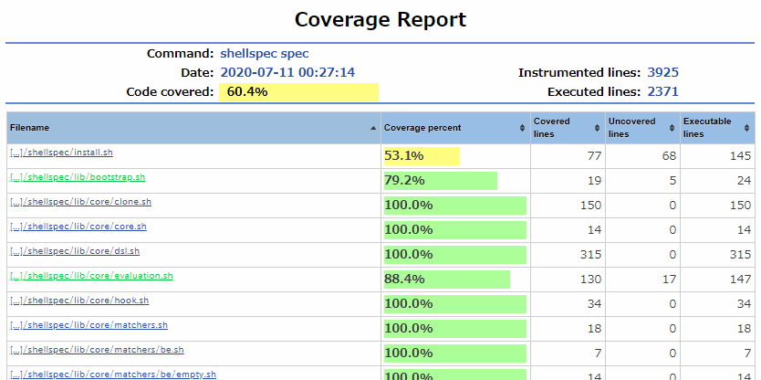

# ShellSpec

ShellSpec is a **full-featured BDD unit testing framework** for dash, bash, ksh, zsh and **all POSIX shells** that provides first-class features such as code coverage, mocking, parameterized test, parallel execution and more. It was developed as a dev/test tool for **cross-platform shell scripts and shell script libraries**. ShellSpec is a new modern testing framework released in 2019, but it's already stable enough. With lots of practical CLI features and simple yet powerful syntax, it provides you with a fun shell script test environment.

[](https://github.com/shellspec/shellspec/actions)
[](https://travis-ci.com/shellspec/shellspec)
[](https://cirrus-ci.com/github/shellspec/shellspec)
[](https://circleci.com/gh/shellspec/shellspec)
[](https://hub.docker.com/r/shellspec/shellspec)<br>
[](https://circleci.com/api/v1.1/project/github/shellspec/shellspec/latest/artifacts/0/coverage/index.html?branch=master)
[](https://coveralls.io/github/shellspec/shellspec?branch=master)
[](https://codeclimate.com/github/shellspec/shellspec)
[](https://codecov.io/gh/shellspec/shellspec)
[](https://www.codefactor.io/repository/github/shellspec/shellspec)
[](https://github.com/shellspec/shellspec/search?l=Shell)
[](https://github.com/shellspec/shellspec/releases/latest)
[](https://github.com/shellspec/shellspec/blob/master/LICENSE)

[](https://www.gnu.org/software/bash/)
[](http://schilytools.sourceforge.net/bosh.html)
[](https://www.busybox.net/)
[](http://gondor.apana.org.au/~herbert/dash/)
[](http://kornshell.org)
[](http://www.mirbsd.org/mksh.htm)
[](https://salsa.debian.org/clint/posh)
[](https://yash.osdn.jp/)
[](https://www.zsh.org/)

----

**Version 0.28.0** has a lot of enhancements in the CLI. It is basically compatible, but there are some changes that you need to be aware of. See [Migration Guide to Version 0.28.0](https://github.com/shellspec/shellspec/wiki/Migration-Guide-to-Version-0.28.0) for details.

----

**Thank you for your interest in ShellSpec. Please visit 🚩[the official website](https://shellspec.info/) to know the impressive features!**

Let's have fun testing your shell scripts! (Try [Online Demo](https://shellspec.info/demo) on your browser).

[](https://shellspec.info/demo)

[](https://circleci.com/api/v1.1/project/github/shellspec/shellspec/latest/artifacts/0/coverage/index.html?branch=master)

**Latest Update.**

See [CHANGELOG.md](CHANGELOG.md)

NOTE: This documentation contains unreleased features. Check them in the changelog.

----

## Table of Contents <!-- omit in toc -->

- [Supported shells and platforms](#supported-shells-and-platforms)
- [Requirements](#requirements)
- [Installation](#installation)
  - [Web installer (for developers)](#web-installer-for-developers)
  - [Package manager](#package-manager)
  - [Manual installation](#manual-installation)
  - [Distribution archive (runtime only)](#distribution-archive-runtime-only)
- [Tutorial](#tutorial)
- [ShellSpec CLI](#shellspec-cli)
  - [runs specfile using `/bin/sh` by default](#runs-specfile-using-binsh-by-default)
  - [command options](#command-options)
- [Project directory](#project-directory)
  - [Typical directory structure](#typical-directory-structure)
  - [Options file](#options-file)
  - [`.shellspec` - project options file](#shellspec---project-options-file)
  - [`.shellspec-local` - user custom options file](#shellspec-local---user-custom-options-file)
  - [`.shellspec-basedir` - specfile execution base directory](#shellspec-basedir---specfile-execution-base-directory)
  - [`.shellspec-quick.log` - quick execution log](#shellspec-quicklog---quick-execution-log)
  - [`report/` - report file directory](#report---report-file-directory)
  - [`coverage/` - coverage reports directory](#coverage---coverage-reports-directory)
  - [`spec/` - (default) specfiles directory](#spec---default-specfiles-directory)
  - [\<HELPERDIR\> (default: `spec/`)](#helperdir-default-spec)
    - [`spec_helper.sh` - (default) helper file for specfile](#spec_helpersh---default-helper-file-for-specfile)
    - [`banner[.md]` - banner file displayed at test execution](#bannermd---banner-file-displayed-at-test-execution)
    - [`support/` - directory for support files](#support---directory-for-support-files)
      - [`bin` - directory for support commands](#bin---directory-for-support-commands)
- [Specfile (test file)](#specfile-test-file)
  - [Example](#example)
  - [About DSL](#about-dsl)
  - [Execution directory](#execution-directory)
  - [Embedded shell scripts](#embedded-shell-scripts)
  - [Translation process](#translation-process)
- [DSL syntax](#dsl-syntax)
  - [Basic structure](#basic-structure)
    - [`Describe`, `Context`, `ExampleGroup` - example group block](#describe-context-examplegroup---example-group-block)
    - [`It`, `Specify`, `Example` - example block](#it-specify-example---example-block)
    - [`Todo` - one liner empty example](#todo---one-liner-empty-example)
    - [`When` - evaluation](#when---evaluation)
      - [`call` - call a shell function (without subshell)](#call---call-a-shell-function-without-subshell)
      - [`run` - run a command (within subshell)](#run---run-a-command-within-subshell)
        - [`command` - runs an external command](#command---runs-an-external-command)
        - [`script` - runs a shell script](#script---runs-a-shell-script)
        - [`source` - runs a script by `.` (dot) command](#source---runs-a-script-by--dot-command)
      - [About executing aliases](#about-executing-aliases)
    - [`The` - expectation](#the---expectation)
      - [Subjects](#subjects)
      - [Modifiers](#modifiers)
      - [Matchers](#matchers)
      - [Language chains](#language-chains)
    - [`Assert` - expectation for custom assertion](#assert---expectation-for-custom-assertion)
  - [Pending, skip and focus](#pending-skip-and-focus)
    - [`Pending` - pending example](#pending---pending-example)
    - [`Skip` - skip example](#skip---skip-example)
      - [`if` - conditional skip](#if---conditional-skip)
    - ['x' prefix for example group and example](#x-prefix-for-example-group-and-example)
      - [`xDescribe`, `xContext`, `xExampleGroup` - skipped example group](#xdescribe-xcontext-xexamplegroup---skipped-example-group)
      - [`xIt`, `xSpecify`, `xExample` - skipped example](#xit-xspecify-xexample---skipped-example)
    - ['f' prefix for example group and example](#f-prefix-for-example-group-and-example)
      - [`fDescribe`, `fContext`, `fExampleGroup` - focused example group](#fdescribe-fcontext-fexamplegroup---focused-example-group)
      - [`fIt`, `fSpecify`, `fExample` - focused example](#fit-fspecify-fexample---focused-example)
    - [About temporary pending and skip](#about-temporary-pending-and-skip)
  - [Hooks](#hooks)
    - [`BeforeEach` (`Before`), `AfterEach` (`After`) - example hook](#beforeeach-before-aftereach-after---example-hook)
    - [`BeforeAll`, `AfterAll` - example group hook](#beforeall-afterall---example-group-hook)
    - [`BeforeCall`, `AfterCall` - call evaluation hook](#beforecall-aftercall---call-evaluation-hook)
    - [`BeforeRun`, `AfterRun` - run evaluation hook](#beforerun-afterrun---run-evaluation-hook)
  - [Helpers](#helpers)
    - [`Dump` - dump stdout, stderr and status for debugging](#dump---dump-stdout-stderr-and-status-for-debugging)
    - [`Include` - include a script file](#include---include-a-script-file)
    - [`Set` - set shell option](#set---set-shell-option)
    - [`Path`, `File`, `Dir` - path alias](#path-file-dir---path-alias)
    - [`Data` - pass data as stdin to evaluation](#data---pass-data-as-stdin-to-evaluation)
    - [`Parameters` - parameterized example](#parameters---parameterized-example)
    - [`Mock` - create a command-based mock](#mock---create-a-command-based-mock)
    - [`Intercept` - create an intercept point](#intercept---create-an-intercept-point)
- [Directives](#directives)
  - [`%const` (`%`) - constant definition](#const----constant-definition)
  - [`%text` - embedded text](#text---embedded-text)
  - [`%puts` (`%-`), `%putsn` (`%=`) - output a string (with newline)](#puts---putsn----output-a-string-with-newline)
  - [`%printf` - alias for printf](#printf---alias-for-printf)
  - [`%sleep` - alias for sleep](#sleep---alias-for-sleep)
  - [`%preserve` - preserve variables](#preserve---preserve-variables)
  - [`%logger` - debug output](#logger---debug-output)
  - [`%data` - define parameter](#data---define-parameter)
- [Mocking](#mocking)
  - [Function-based mock](#function-based-mock)
  - [Command-based mock](#command-based-mock)
- [Interceptor](#interceptor)
  - [Intercept](#intercept)
  - [`__`](#__)
  - [`test || __() { :; }`](#test--__---)
- [Support commands](#support-commands)
  - [Execute the actual command within a mock function](#execute-the-actual-command-within-a-mock-function)
  - [Make mock not mandatory in sandbox mode](#make-mock-not-mandatory-in-sandbox-mode)
  - [Resolve command incompatibilities](#resolve-command-incompatibilities)
- [Tagging](#tagging)
- [How to test a single file shell script](#how-to-test-a-single-file-shell-script)
  - [Using Sourced Return](#using-sourced-return)
  - [Using Interceptor](#using-interceptor)
- [spec_helper](#spec_helper)
  - [`<module>_precheck`](#module_precheck)
    - [`minimum_version`](#minimum_version)
    - [`error`, `warn`, `info`](#error-warn-info)
    - [`abort`](#abort)
    - [`setenv`, `unsetenv`](#setenv-unsetenv)
    - [environment variables](#environment-variables)
  - [`<module>_loaded`](#module_loaded)
  - [`<module>_configure`](#module_configure)
    - [`import`](#import)
    - [`before_each`, `after_each`](#before_each-after_each)
    - [`before_all`, `after_all`](#before_all-after_all)
- [Self-executable specfile](#self-executable-specfile)
- [Use with Docker](#use-with-docker)
- [Extension](#extension)
  - [Custom subject, modifier and matcher](#custom-subject-modifier-and-matcher)
- [For developers](#for-developers)
  - [Subprojects](#subprojects)
    - [ShellMetrics - Cyclomatic Complexity Analyzer for shell scripts](#shellmetrics---cyclomatic-complexity-analyzer-for-shell-scripts)
    - [ShellBench - A benchmark utility for POSIX shell comparison](#shellbench---a-benchmark-utility-for-posix-shell-comparison)
  - [Related projects](#related-projects)
    - [getoptions - An elegant option parser and generator for shell scripts](#getoptions---an-elegant-option-parser-and-generator-for-shell-scripts)
    - [readlinkf - readlink -f implementation for shell scripts](#readlinkf---readlink--f-implementation-for-shell-scripts)
  - [Inspired frameworks](#inspired-frameworks)
  - [Contributions](#contributions)

## Supported shells and platforms

- <code>[bash][bash]</code>_>=2.03_, <code>[bosh/pbosh][bosh]</code>_>=2018/10/07_, <code>[posh][posh]</code>_>=0.3.14_, <code>[yash][yash]</code>_>=2.29_, <code>[zsh][zsh]</code>_>=3.1.9_
- <code>[dash][dash]</code>_>=0.5.4_, <code>[busybox][busybox] ash</code>_>=1.20.0_, <code>[busybox-w32][busybox-w32]</code>, <code>[GWSH][gwsh]</code>_>=20190627_
- <code>ksh88</code>, <code>[ksh93][ksh93]</code>_>=93s_, <code>[ksh2020][ksh2020]</code>, <code>[mksh/lksh][mksh]</code>_>=R28_, <code>[pdksh][pdksh]</code>_>=5.2.14_
- <code>[FreeBSD sh][freebsdsh]</code>, <code>[NetBSD sh][netbsdsh]</code>, <code>[NetBSD ksh][netbsdksh]</code>, <code>[OpenBSD ksh][openbsdksh]</code>, <code>[loksh][loksh]</code>, <code>[oksh][oksh]</code>

[bash]: https://www.gnu.org/software/bash/
[bosh]: http://schilytools.sourceforge.net/bosh.html
[busybox]: https://www.busybox.net/
[busybox-w32]: https://frippery.org/busybox/
[dash]: http://gondor.apana.org.au/~herbert/dash/
[gwsh]: https://github.com/hvdijk/gwsh
[ksh93]: http://kornshell.org
[ksh2020]: https://github.com/ksh-community/ksh
[mksh]: http://www.mirbsd.org/mksh.htm
[posh]: https://salsa.debian.org/clint/posh
[yash]: https://yash.osdn.jp/
[zsh]: https://www.zsh.org/
[netbsdsh]: http://cvsweb.netbsd.org/bsdweb.cgi/src/bin/sh/
[netbsdksh]: http://cvsweb.netbsd.org/bsdweb.cgi/src/bin/ksh/
[freebsdsh]: https://www.freebsd.org/cgi/man.cgi?sh(1)
[openbsdksh]: https://man.openbsd.org/ksh.1
[pdksh]: https://web.archive.org/web/20160918190548/http://www.cs.mun.ca:80/~michael/pdksh/
[loksh]: https://github.com/dimkr/loksh
[oksh]: https://github.com/ibara/oksh

| Platform                                                         | Test                                               |
| ---------------------------------------------------------------- | -------------------------------------------------- |
| Linux (Debian, Ubuntu, Fedora, CentOS, Alpine, Busybox, OpenWrt) | [GitHub Actions][Actions] or [Docker][Docker]      |
| macOS (Default installed shells, Homebrew)                       | [GitHub Actions][Actions] or [Travis CI][TravisCI] |
| Windows (Git bash, msys2, cygwin, busybox-w32, WSL)              | [GitHub Actions][Actions]                          |
| BSD (FreeBSD, OpenBSD, NetBSD)                                   | [Cirrus CI][CirrusCI] (FreeBSD) or Manual (Others) |
| Unix (Solaris, AIX)                                              | Manual only                                        |

[Actions]: https://github.com/shellspec/shellspec/actions
[TravisCI]: https://travis-ci.com/shellspec/shellspec
[CirrusCI]: https://cirrus-ci.com/github/shellspec/shellspec
[Docker]: dockerfiles

[Tested version details](docs/shells.md)

## Requirements

### POSIX-compliant commands <!-- omit in toc -->

ShellSpec uses shell built-in commands and only few basic [POSIX-compliant commands][utilities] to
support wide range of environments (except `kcov` for optional code coverage).

[utilities]: http://pubs.opengroup.org/onlinepubs/9699919799/utilities/contents.html

Currently used external (not shell builtins) commands:

- `cat`, `date`, `env`, `ls`, `mkdir`, `od` (or not POSIX `hexdump`), `rm`, `sleep`, `sort`, `time`
- `ps` (use to auto-detect shells in environments that don't implement procfs)
- `ln`, `mv` (use only when generating coverage report)
- `kill`, `printf` (most shells except some are built-in)

## Installation

### Web installer (for developers)

#### Install the latest release version <!-- omit in toc -->

```sh
curl -fsSL https://git.io/shellspec | sh
```

or

```sh
wget -O- https://git.io/shellspec | sh
```

NOTE: `https://git.io/shellspec` is redirected to [install.sh](https://github.com/shellspec/shellspec/raw/master/install.sh)

The installation using the web installer is mainly intended for development use.
For CI, it is recommended to use a specific version (tag) in git or archives to avoid unexpected failures.

<details>
<summary>Advanced installation / upgrade</summary>

#### Automatic installation <!-- omit in toc -->

```sh
curl -fsSL https://git.io/shellspec | sh -s -- --yes
```

#### Install the specified version <!-- omit in toc -->

```sh
curl -fsSL https://git.io/shellspec | sh -s 0.19.1
```

#### Upgrade to the latest release version <!-- omit in toc -->

```sh
curl -fsSL https://git.io/shellspec | sh -s -- --switch
```

#### Switch to the specified version <!-- omit in toc -->

```sh
curl -fsSL https://git.io/shellspec | sh -s 0.18.0 --switch
```

</details>

<details>
<summary>Uninstall</summary>

#### How to uninstall <!-- omit in toc -->

1. Delete the ShellSpec executable file [default: `$HOME/.local/bin/shellspec`].
2. Delete the ShellSpec installation directory [default: `$HOME/.local/lib/shellspec`].

</details>

<details>
<summary>Other usage</summary>

### Other usage <!-- omit in toc -->

```console
$ curl -fsSL https://git.io/shellspec | sh -s -- --help
Usage: [sudo] ./install.sh [VERSION] [OPTIONS...]
  or : wget -O- https://git.io/shellspec | [sudo] sh
  or : wget -O- https://git.io/shellspec | [sudo] sh -s -- [OPTIONS...]
  or : wget -O- https://git.io/shellspec | [sudo] sh -s VERSION [OPTIONS...]
  or : curl -fsSL https://git.io/shellspec | [sudo] sh
  or : curl -fsSL https://git.io/shellspec | [sudo] sh -s -- [OPTIONS...]
  or : curl -fsSL https://git.io/shellspec | [sudo] sh -s VERSION [OPTIONS...]

VERSION:
  Specify install version and method

  e.g
    1.0.0           Install 1.0.0 from git
    master          Install master from git
    1.0.0.tar.gz    Install 1.0.0 from tar.gz archive
    .               Install from local directory

OPTIONS:
  -p, --prefix PREFIX   Specify prefix                 [default: $HOME/.local]
  -b, --bin BIN         Specify bin directory          [default: <PREFIX>/bin]
  -d, --dir DIR         Specify installation directory [default: <PREFIX>/lib/shellspec]
  -s, --switch          Switch version (requires installation via git)
  -l, --list            List available versions (tags)
      --pre             Include pre-release
      --fetch FETCH     Force command to use when installing from archive (curl or wget)
  -y, --yes             Automatic yes to prompts
  -h, --help            You're looking at it
```

</details>

### Package manager

<details>
<summary>Arch Linux</summary>

Installation on Arch Linux from the AUR [ShellSpec package](https://aur.archlinux.org/packages/shellspec/) using `aura`:

```console
# Install the latest stable version
$ aura -A shellspec
```

</details>

<details>
<summary>Homebrew / Linuxbrew</summary>

```console
# Install the latest stable version
$ brew tap shellspec/shellspec
$ brew install shellspec
```

</details>

<details>
<summary>basher / bpkg</summary>

Installation with [basher](https://github.com/basherpm/basher)

**The officially supported version is ShellSpec 0.19.1 and later.**

```console
# Install from master branch
$ basher install shellspec/shellspec

# To specify a version (example: 0.19.1)
$ basher install shellspec/shellspec@0.19.1
```

Installation with [bpkg](https://github.com/bpkg/bpkg)

**The officially supported version is ShellSpec 0.19.1 and later.**

```console
# Install from master branch
$ bpkg install shellspec/shellspec

# To specify a version (example: 0.19.1)
$ bpkg install shellspec/shellspec@0.19.1
```

</details>

### Manual installation

<details>
<summary>git / archive (source code)</summary>

Download from git or archive and create a symbolic link.

From git

```console
$ cd /SOME/WHERE/TO/INSTALL
$ git clone https://github.com/shellspec/shellspec.git

$ ln -s /SOME/WHERE/TO/INSTALL/shellspec/shellspec /EXECUTABLE/PATH/
```

From archive

```console
$ cd /SOME/WHERE/TO/INSTALL
$ wget https://github.com/shellspec/shellspec/archive/{VERSION}.tar.gz
$ tar xzvf shellspec-{VERSION}.tar.gz

$ ln -s /SOME/WHERE/TO/INSTALL/shellspec-{VERSION}/shellspec /EXECUTABLE/PATH/
```

Executable path: e.g. `/usr/local/bin/`, `$HOME/bin/`

</details>

<details>
<summary>Use make instead of symbolic link creation</summary>

Download from git or archive and use `make` command.

**How to install.**

Install to `/usr/local/bin` and `/usr/local/lib`

```sh
sudo make install
```

Install to `$HOME/bin` and `$HOME/lib`

```sh
make install PREFIX=$HOME
```

**How to uninstall.**

```sh
sudo make uninstall
```

```sh
make uninstall PREFIX=$HOME
```

</details>

<details>
<summary>For environments that do not support symbolic links</summary>

Download from git or archive and create the following `shellspec` file instead of the symbolic link.

```console
$ cat<<'HERE'>/EXECUTABLE/PATH/shellspec
#!/bin/sh
exec /SOME/WHERE/TO/INSTALL/shellspec/shellspec "$@"
HERE
$ chmod +x /EXECUTABLE/PATH/shellspec
```

</details>

### Distribution archive (runtime only)

See [Releases](https://github.com/shellspec/shellspec/releases) page if you want to download distribution archive.

## Tutorial

**Just create your project directory and run `shellspec --init` to setup your project**

```console
# Create your project directory, for example "hello".
$ mkdir hello
$ cd hello

# Initialize
$ shellspec --init
  create   .shellspec
  create   spec/spec_helper.sh

# Write your first specfile (of course you can use your favorite editor)
$ cat<<'HERE'>spec/hello_spec.sh
Describe 'hello.sh'
  Include lib/hello.sh
  It 'says hello'
    When call hello ShellSpec
    The output should equal 'Hello ShellSpec!'
  End
End
HERE

# Create lib/hello.sh
$ mkdir lib
$ touch lib/hello.sh

# It will fail because the hello function is not implemented.
$ shellspec

# Write hello function
$ cat<<'HERE'>lib/hello.sh
hello() {
  echo "Hello ${1}!"
}
HERE

# It will success!
$ shellspec
```

## ShellSpec CLI

### runs specfile using `/bin/sh` by default

ShellSpec CLI runs specfiles with the shell running `shellspec`.
Usually it is `/bin/sh` that is the shebang of `shellspec`. If you run `bash shellspec`, it will be bash.
`Include` files from specfile will be executed in the same shell as well.

The purpose of this specification is to allow ShellSpec to easily change multiple types of shells
and enable the development of cross-platform shell scripts that support multiple shells and environments.

If you want to test with a specific shell, use the `-s` (`--shell`) option.
You can specify the default shell in the `.shellspec` file.

NOTE: If you execute a **shell script file** (not a shell function) from within the specfile,
its shebang will be respected. Because in that case, it will be run as an external command.
The `-s` (`--shell`) option also has no effect.
If you are testing a external shell script file, you can use `When run script` or `When run source`.
These ignore the shebang of external shell script file and run in the same shell that runs specfile.

### command options

NOTE: Since version 0.28.0, [getoptions](https://github.com/ko1nksm/getoptions) is used to parse options,
so all POSIX and GNU compatible option syntax can be used. For example, you can abbreviate a long option.

See more info: [ShellSpec CLI](docs/cli.md)

```console
$ shellspec -h
Usage: shellspec [ -c ] [-C <directory>] [options...] [files or directories...]

  Using + instead of - for short options causes reverses the meaning

    -s, --shell SHELL               Specify a path of shell [default: "auto" (the shell running shellspec)]
        --require MODULE            Require a MODULE (shell script file)
    -O, --options PATH              Specify the path to an additional options file
    -I, --load-path PATH            Specify PATH to add to $SHELLSPEC_LOAD_PATH (may be used more than once)
        --helperdir DIRECTORY       The directory to load helper files (spec_helper.sh, etc) [default: "spec"]
        --path PATH                 Set PATH environment variable at startup
        --{no-}sandbox              Force the use of the mock instead of the actual command
        --sandbox-path PATH         Make PATH the sandbox path instead of empty [default: empty]
        --execdir @LOCATION[/DIR]   Specify the execution directory of each specfile | [default: @project]
    -e, --env NAME[=VALUE]          Set environment variable
        --env-from ENV-SCRIPT       Set environment variable from shell script file
    -w, --{no-}warning-as-failure   Treat warning as failure [default: enabled]
        --{no-}fail-fast[=COUNT]    Abort the run after first (or COUNT) of failures [default: disabled]
        --{no-}fail-no-examples     Fail if no examples found [default: disabled]
        --{no-}fail-low-coverage    Fail on low coverage [default: disabled]
        --failure-exit-code CODE    Override the exit code used when there are failing specs [default: 101]
        --error-exit-code CODE      Override the exit code used when there are fatal errors [default: 102]
    -p, --{no-}profile              Enable profiling and list the slowest examples [default: disabled]
        --profile-limit N           List the top N slowest examples [default: 10]
        --{no-}boost                Increase the CPU frequency to boost up testing speed [default: disabled]
        --log-file LOGFILE          Log file for %logger directive and trace [default: "/dev/tty"]
        --tmpdir TMPDIR             Specify temporary directory [default: $TMPDIR, $TMP or "/tmp"]
        --keep-tmpdir               Do not cleanup temporary directory [default: disabled]

  The following options must be specified before other options and cannot be specified in the options file

    -c, --chdir                     Change the current directory to the first path of arguments at the start
    -C, --directory DIRECTORY       Change the current directory at the start

  **** Execution ****

    -q, --{no-}quick                Run not-passed examples if it exists, otherwise run all [default: disabled]
    -r, --repair, --only-failures   Run failure examples only (Depends on quick mode)
    -n, --next-failure              Run failure examples and abort on first failure (Depends on quick mode)
    -j, --jobs JOBS                 Number of parallel jobs to run [default: 0 (disabled)]
        --random TYPE[:SEED]        Run examples by the specified random type | <[none]> [specfiles] [examples]
    -x, --xtrace                    Run examples with trace output of evaluation enabled [default: disabled]
    -X, --xtrace-only               Run examples with trace output only enabled [default: disabled]
        --dry-run                   Print the formatter output without running any examples [default: disabled]

  **** Output ****

        --{no-}banner               Show banner if exist "<HELPERDIR>/banner[.md]" [default: enabled]
        --reportdir DIRECTORY       Output directory of the report [default: "report"]
    -f, --format FORMATTER          Choose a formatter for display | <[p]> [d] [t] [j] [f] [null] [debug]
    -o, --output FORMATTER          Choose a generator(s) to generate a report file(s) [default: none]
        --{no-}color                Enable or disable color [default: enabled if the output is a TTY]
        --skip-message VERBOSITY    Mute skip message | <[verbose]> [moderate] [quiet]
        --pending-message VERBOSITY Mute pending message | <[verbose]> [quiet]
        --quiet                     Equivalent of --skip-message quiet --pending-message quiet
        --(show|hide)-deprecations  Show or hide deprecations details [default: show]

  **** Ranges / Filters / Focus ****

    You can run selected examples by specified the line numbers or ids

      shellspec path/to/a_spec.sh:10   # Run the groups or examples that includes lines 10
      shellspec path/to/a_spec.sh:@1-5 # Run the 5th groups/examples defined in the 1st group
      shellspec a_spec.sh:10:@1:20:@2  # You can mixing multiple line numbers and ids with join by ":"

    -F, --focus                     Run focused groups / examples only
    -P, --pattern PATTERN           Load files matching pattern [default: "*_spec.sh"]
    -E, --example PATTERN           Run examples whose names include PATTERN
    -T, --tag TAG[:VALUE]           Run examples with the specified TAG
        --default-path PATH         Set the default path where looks for examples [default: "spec"]

    You can specify the path recursively by prefixing it with the pattern "*/" or "**/"
      (This is not glob patterns and requires quotes. It is also available with --default-path)

      shellspec "*/spec"               # The pattern "*/" matches 1 directory
      shellspec "**/spec"              # The pattern "**/" matches 0 and more directories
      shellspec "*/*/**/test_spec.sh"  # These patterns can be specified multiple times

    -L, --dereference               Dereference all symlinks in in the above pattern [default: disabled]

  **** Coverage ****

        --covdir DIRECTORY          Output directory of the Coverage Report [default: coverage]
        --{no-}kcov                 Enable coverage using kcov [default: disabled]
        --kcov-path PATH            Specify kcov path [default: kcov]
        --kcov-options OPTIONS      Additional Kcov options (coverage limits, coveralls id, etc)

  **** Utility ****

        --init [TEMPLATE...]        Initialize your project with ShellSpec | [spec] [git] [hg] [svn]
        --gen-bin [@COMMAND...]     Generate test support commands in "<HELPERDIR>/support/bin"
        --count                     Count the number of specfiles and examples
        --list LIST                 List the specfiles/examples | [specfiles] [examples(:id|:lineno)]
        --syntax-check              Syntax check of the specfiles without running any examples
        --translate                 Output translated specfile
        --task [TASK]               Run the TASK or Show the task list if TASK is not specified
        --docker DOCKER-IMAGE       Run tests in specified docker image (EXPERIMENTAL)
    -v, --version                   Display the version
    -h, --help                      -h: short help, --help: long help
```

## Project directory

All specfiles for ShellSpec must be under the project directory. The root of the project directory
must have a `.shellspec` file. This file is that specify the default options to be used in
the project, but an empty file is required even if the project has no options.

NOTE: The `.shellspec` file was described in the documentation as a required file for some time,
but ShellSpec worked without it. Starting with version 0.28.0, this file is checked and will be
required in future versions.

You can easily create the necessary files by executing the `shellspec --init` command in an existing directory.

### Typical directory structure

This is the typical directory structure. Version 0.28.0 allows many of these to be changed by specifying options, supporting a more flexible [directory structure](docs/directory_structure.md).

```text
<PROJECT-ROOT> directory
├─ .shellspec                       [mandatory]
├─ .shellspec-local                 [optional] Ignore from version control
├─ .shellspec-quick.log             [optional] Ignore from version control
├─ report/                          [optional] Ignore from version control
├─ coverage/                        [optional] Ignore from version control
│
├─ bin/
│   ├─ your_script1.sh
│              :
├─ lib/
│   ├─ your_library1.sh
│              :
│
├─ spec/ (also <HELPERDIR>)
│   ├─ spec_helper.sh               [recommended]
│   ├─ banner[.md]                  [optional]
│   ├─ support/                     [optional]
│   │
│   ├─ bin/
│   │   ├─ your_script1_spec.sh
│   │             :
│   ├─ lib/
│   │   ├─ your_library1_spec.sh
```

### Options file

To change the default options for the `shellspec` command, create options file(s).
Files are read in the order shown below, options defined last take precedence.

1. `$XDG_CONFIG_HOME/shellspec/options`
2. `$HOME/.shellspec-options` (version >= 0.28.0) or `$HOME/.shellspec` (deprecated)
3. `<PROJECT-ROOT>/.shellspec`
4. `<PROJECT-ROOT>/.shellspec-local` (Do not store in VCS such as git)

Specify your default options with `$XDG_CONFIG_HOME/shellspec/options` or `$HOME/.shellspec-options`.
Specify default project options with `.shellspec` and overwrite to your favorites with `.shellspec-local`.

### `.shellspec` - project options file

Specifies the default options to use for the project.

### `.shellspec-local` - user custom options file

Override the default options used by the project with your favorites.

### `.shellspec-basedir` - specfile execution base directory

Used to specify the directory in which the specfile will be run.
See [directory structure](docs/directory_structure.md) or `--execdir` option for details.

### `.shellspec-quick.log` - quick execution log

If this file is present, Quick mode will be enabled and the log of Quick execution will be recorded.
It created automatically when `--quick` option is specified.
If you want to turn off Quick mode, delete it.

### `report/` - report file directory

The output location for reports generated by the `--output` or `--profile` options.
This can be changed with the `--reportdir` option.

### `coverage/` - coverage reports directory

The output location for coverage reports.
This can be changed with the `--covdir` option.

### `spec/` - (default) specfiles directory

By default, it is assumed that all specfiles are store under the `spec` directory,
but it is possible to create multiple directories with different names.

NOTE: In Version <= 0.27.x, the `spec` directory was the only directory that contained the specfiles.

### \<HELPERDIR\> (default: `spec/`)

The directory to store `spec_helper.sh` and other files.
By default, the `spec` directory also serves as `HELPERDIR` directory,
but you can change it to another directory with the `--helperdir` option.

#### `spec_helper.sh` - (default) helper file for specfile

The `spec_helper.sh` is loaded to specfile by the `--require spec_helper` option.
This file is used to define global functions, initial setting for examples, custom matchers, etc.

#### `banner[.md]` - banner file displayed at test execution

If the file `<HELPERDIR>/banner` or `<HELPERDIR>/banner.md` exists, Display a banner when
the `shellspec` command is executed. It can be used to display information about the tests.
The `--no-banner` option can be used to disable this behavior.

#### `support/` - directory for support files

This directory can be used to store files such as custom matchers and tasks.

##### `bin` - directory for support commands

This directory is used to store [support commands](#support-commands).

## Specfile (test file)

In ShellSpec, you write your tests in a specfile.
By default, specfile is a file ending with `_spec.sh` under the `spec` directory.

The specfile is executed using the `shellspec` command, but it can also be executed directly.
See [self-executable specfile](#self-executable-specfile) for details.

### Example

```sh
Describe 'lib.sh' # example group
  Describe 'bc command'
    add() { echo "$1 + $2" | bc; }

    It 'performs addition' # example
      When call add 2 3 # evaluation
      The output should eq 5  # expectation
    End
  End
End
```

**The best place to learn how to write a specfile is the
[examples/spec](examples/spec) directory. You should take a look at it !**
*(Those examples include failure examples on purpose.)*

### About DSL

ShellSpec has its own DSL to write tests. It may seem like a distinctive code because DSL starts
with a capital letter, but the syntax is compatible with shell scripts, and you can embed
shell functions and use [ShellCheck](https://github.com/koalaman/shellcheck) to check the syntax.

You may feel rejected by this DSL, but It starts with a capital letter to avoid confusion with
the command, and it does a lot more than you think, such as realizing scopes, getting
shell-independent line numbers, and workarounds for bugs in some shells.

### Execution directory

Since version 0.28.0, the current directory when run a specfile is the project root directory by default. Even if you run a specfile from a any subdirectory in the project directory,
It is the project root directory.
Before 0.27.x, it was the current directory when the `shellspec` is executed.

You can change this directory (location) by using the `--execdir @LOCATION[/DIR]` option.
You can choose from the following locations and specify a path relative to the location if necessary.
However, you cannot specify a directory outside the project directory.

- @project   Where the ".shellspec" file is located (project root) [default]
- @basedir   Where the ".shellspec" or ".shellspec-basedir" file is located
- @specfile  Where the specfile is located

If basedir is specified, the parent directory is searched from the directory containing the specfile
to be run, and the first directory where `.shellspec-basedir` or `.shellspec` is found is used as
the execution directory. This is useful if you want to have a separate directory for each
utilities (command) you want to test.

NOTE: You will need to change under the project directory or use the `-c` (`--chdir`) or
`-C` (`--directory`) option before running specfile.

### Embedded shell scripts

You can embed shell function (or shell script code) in the specfile.
This shell function can be used for test preparation and complex testing.

Note that the specfile implements the scope using subshell.
Shell functions defined in the specfile can only be used within blocks (e.g. `Describe`, `It`, etc).

If you want to use a global function, you can define it in `spec_helper.sh`.

### Translation process

The specfile will not be executed directly by the shell, but will be translated into a regular
shell script and output to a temporary directory (default: `/tmp`) before being executed.

The translation process is simple in that it only replaces forward-matched words (DSLs), with a few
exceptions. If you are interested in the translated code, you can see with `shellspec --translate`.

## DSL syntax

### Basic structure

#### `Describe`, `Context`, `ExampleGroup` - example group block

`ExampleGroup` is a block for grouping example groups or examples.
`Describe` and `Context` are alias for `ExampleGroup`.
It can be nested and they can contain example groups or examples.

```sh
Describe 'is example group'
  Describe 'is nestable'
    ...
  End

  Context 'is used to facilitate understanding depending on the context'
    ...
  End
End
```

The example groups can be optionally tagged. See [Tagging](#tagging) for details.

```sh
Describe 'is example group' tag1:value1 tag2:value2 ...
```

#### `It`, `Specify`, `Example` - example block

`Example` is a block for writing evaluation and expectations.
`It` and `Specify` are alias for `Example`.

An example is composed by up to one evaluation and multiple expectations.

```sh
add() { echo "$1 + $2" | bc; }

It 'performs addition'          # example
  When call add 2 3             # evaluation
  The output should eq 5        # expectation
  The status should be success  # another expectation
End
```

The examples can be optionally tagged. See [Tagging](#tagging) for details.

```sh
It 'performs addition' tag1:value1 tag2:value2 ...
```

#### `Todo` - one liner empty example

`Todo` is the same as the empty example and is treated as [pending](#pending---pending-example) example.

```sh
Todo 'will be used later when we write a test'

It 'is an empty example, the same as Todo'
End
```

#### `When` - evaluation

Evaluation executes shell function or command for verification.
Only one evaluation can be defined for each example and also can be omitted.

See more details of [Evaluation](docs/references.md#evaluation)

NOTE: [About executing aliases](#about-executing-aliases)

##### `call` - call a shell function (without subshell)

It calls a function without subshell.
Practically, it can also run commands.

```sh
When call add 1 2 # call `add` shell function with two arguments.
```

##### `run` - run a command (within subshell)

It runs a command within subshell. Practically, it can also call a shell function.
The command does not have to be a shell script.

NOTE: This is not supporting coverage measurement.

```sh
When run touch /tmp/foo # run `touch` command.
```

Some commands below are specially handled by ShellSpec.

###### `command` - runs an external command

It runs a command, respecting shebang.
It can not call shell function. The command does not have to be a shell script.

NOTE: This is not supporting coverage measurement.

```sh
When run command touch /tmp/foo # run `touch` command.
```

###### `script` - runs a shell script

It runs a shell script, ignoring shebang. The script has to be a shell script.
It will be executed in another instance of the same shell as the current shell.

```sh
When run script my.sh # run `my.sh` script.
```

###### `source` - runs a script by `.` (dot) command

It sources a shell script, ignoring its shebang. The script has to be a shell script.
It is similar to `run script`, but with some differences.
Unlike `run script`, function-based mock is available.

```sh
When run source my.sh # source `my.sh` script.
```

##### About executing aliases

If you want to execute aliases, you need a workaround using `eval`.

```sh
alias alias-name='echo this is alias'
When call alias-name # alias-name: not found

# eval is required
When call eval alias-name

# When using embedded shell scripts
foo() { eval alias-name; }
When call foo
```

#### `The` - expectation

Expectation begins with `The` which does the verification.
The basic syntax is as follows:

```sh
The output should equal 4
```

Use `should not` for the opposite verification.

```sh
The output should not equal 4
```

##### Subjects

The subject is the target of the verification.

```sh
The output should equal 4
      |
      +-- subject
```

There are `output` (`stdout`), `error` (`stdout`), `status`, `variable`, `path`, etc. subjects.

Please refer to the [Subjects](docs/references.md#subjects) for more details.

##### Modifiers

The modifier concretizes the target of the verification (subject).

```sh
The line 2 of output should equal 4
      |
      +-- modifier
```

The modifiers are chainable.

```sh
The word 1 of line 2 of output should equal 4
```

If the modifier argument is a number, you can use an ordinal numeral instead of a number.

```sh
The first word of second line of output should equal 4
```

There are `line`, `word`, `length`, `contents`, `result`, etc. modifiers.
The `result` modifier is useful for making the result of a user-defined function the subject.

Please refer to the [Modifiers](docs/references.md#modifiers) for more details.

##### Matchers

The matcher is the verification.

```sh
The output should equal 4
                   |
                   +-- matcher
```

There are many matchers such as string matcher, status matcher, variable matchers and stat matchers.
The `satisfy` matcher is useful for verification with user-defined function.

Please refer to the [Matchers](docs/references.md#matchers) for more details.

##### Language chains

ShellSpec supports *language chains* like [chai.js](https://www.chaijs.com/).
It only improves readability, does not affect the expectation: `a`, `an`, `as`, `the`.

The following two sentences have the same meaning:

```sh
The first word of second line of output should valid number

The first word of the second line of output should valid as a number
```

#### `Assert` - expectation for custom assertion

The `Assert` is yet another expectation to verify with a user-defined function.
It is designed for verification of side effects, not the result of the evaluation.

```sh
still_alive() {
  ping -c1 "$1" >/dev/null
}

Describe "example.com"
  It "responses"
    Assert still_alive "example.com"
  End
End
```

### Pending, skip and focus

#### `Pending` - pending example

`Pending` is similar to `Skip`, but the test passes if the verification fails,
and the test fails if the verification succeeds. This is useful if you want to
specify that you will implement something later.

```sh
Describe 'Pending'
  Pending "not implemented"

  hello() { :; }

  It 'will success when test fails'
    When call hello world
    The output should "Hello world"
  End
End
```

#### `Skip` - skip example

Use `Skip` to skip executing the example.

```sh
Describe 'Skip'
  Skip "not exists bc"

  It 'is always skip'
    ...
  End
End
```

##### `if` - conditional skip

Use `Skip if` if you want to skip conditionally.

```sh
Describe 'Conditional skip'
  not_exists_bc() { ! type bc >/dev/null 2>&1; }
  Skip if "not exists bc" not_exists_bc

  add() { echo "$1 + $2" | bc; }

  It 'performs addition'
    When call add 2 3
    The output should eq 5
  End
End
```

#### 'x' prefix for example group and example

##### `xDescribe`, `xContext`, `xExampleGroup` - skipped example group

`xDescribe`, `xContext`, `xExampleGroup` are skipped example group blocks.
Execution of examples contained in these blocks is skipped.

```sh
Describe 'is example group'
  xDescribe 'is skipped example group'
    ...
  End
End
```

##### `xIt`, `xSpecify`, `xExample` - skipped example

`xIt`, `xSpecify`, `xExample` are skipped example blocks.
Execution of the example is skipped.

```sh
xIt 'is skipped example'
  ...
End
```

#### 'f' prefix for example group and example

##### `fDescribe`, `fContext`, `fExampleGroup` - focused example group

`fDescribe`, `fContext`, `fExampleGroup` are focused example group blocks.
Only the examples included in these will be executed when the `--focus` option is specified.

```sh
Describe 'is example group'
  fDescribe 'is focues example group'
    ...
  End
End
```

##### `fIt`, `fSpecify`, `fExample` - focused example

`fIt`, `fSpecify`, `fExample` are focused example blocks.
Only these examples will be executed when the `--focus` option is specified.

```sh
fIt 'is focused example'
  ...
End
```

#### About temporary pending and skip

The pending and skip without message is "temporary pending" and "temporary skip".
"x"-prefixed example groups and examples are treated as a temporary skip.

The non-temporary pending and skip (with message) is used when it takes a long time to resolve.
It may be committed to a version control system. The temporary pending and skip is used during the current work.
We do not recommend committing it to a version control system.

These two types differ in the display of the report. Refer to `--skip-message` and `--pending-message` options.

```sh
# Temporary pending and skip
Pending
Skip
Skip # this comment will be displayed in the report
Todo
xIt
  ...
End

# Non-temporary pending and skip
Pending "reason"
Skip "reason"
Skip if "reason" condition
Todo "It will be implemented"
```

### Hooks

#### `BeforeEach` (`Before`), `AfterEach` (`After`) - example hook

You can specify commands to be executed before / after each example by `BeforeEach` (`Before`), `AfterEach` (`After`).

NOTE: `BeforeEach` and `AfterEach` are supported in version 0.28.0 and later.
Previous versions should use `Before` and `After` instead.

NOTE: `AfterEach` is for cleanup and not for assertions.

```sh
Describe 'example hook'
  setup() { :; }
  cleanup() { :; }
  BeforeEach 'setup'
  AfterEach 'cleanup'

  It 'is called before and after each example'
    ...
  End

  It 'is called before and after each example'
    ...
  End
End
```

#### `BeforeAll`, `AfterAll` - example group hook

You can specify commands to be executed before / after all examples by `BeforeAll` and `AfterAll`

```sh
Describe 'example all hook'
  setup() { :; }
  cleanup() { :; }
  BeforeAll 'setup'
  AfterAll 'cleanup'

  It 'is called before/after all example'
    ...
  End

  It 'is called before/after all example'
    ...
  End
End
```

#### `BeforeCall`, `AfterCall` - call evaluation hook

You can specify commands to be executed before / after call evaluation by `BeforeCall` and `AfterCall`

NOTE: These hooks were originally created to test ShellSpec itself.
Please use the `BeforeEach` / `AfterEach` hooks whenever possible.

```sh
Describe 'call evaluation hook'
  setup() { :; }
  cleanup() { :; }
  BeforeCall 'setup'
  AfterCall 'cleanup'

  It 'is called before/after call evaluation'
    When call hello world
    ...
  End
End
```

#### `BeforeRun`, `AfterRun` - run evaluation hook

You can specify commands to be executed before / after run evaluation
(`run`, `run command`, `run script` and `run source`) by `BeforeRun` and `AfterRun`

These hooks are executed in the same subshell as the "run evaluation".
Therefore, you can access the variables after executing the evaluation.

NOTE: These hooks were originally created to test ShellSpec itself.
Please use the `BeforeEach` / `AfterEach` hooks whenever possible.

```sh
Describe 'run evaluation hook'
  setup() { :; }
  cleanup() { :; }
  BeforeRun 'setup'
  AfterRun 'cleanup'

  It 'is called before/after run evaluation'
    When run hello world
    ...
  End
End
```

### Helpers

#### `Dump` - dump stdout, stderr and status for debugging

Dump stdout, stderr and status of the evaluation. It is useful for debugging.

```sh
When call echo hello world
Dump # stdout, stderr and status
```

#### `Include` - include a script file

Include a shell script to test.

```sh
Describe 'lib.sh'
  Include lib.sh # hello function defined

  Describe 'hello()'
    It 'says hello'
      When call hello ShellSpec
      The output should equal 'Hello ShellSpec!'
    End
  End
End
```

#### `Set` - set shell option

Set shell option before executing each example.
The shell option name is the long name of `set` or the name of `shopt`:

NOTE: Use `Set` instead of the `set` command because the `set` command
may not work as expected in some shells.

```sh
Describe 'Set helper'
  Set 'errexit:off' 'noglob:on'

  It 'sets shell options before executiong the example'
    When call foo
  End
End
```

#### `Path`, `File`, `Dir` - path alias

`Path` is used to define a short pathname alias.
`File` and `Dir` are aliases for `Path`.

```sh
Describe 'Path helper'
  Path hosts-file="/etc/hosts"

  It 'defines short alias for long path'
    The path hosts-file should be exists
  End
End
```

#### `Data` - pass data as stdin to evaluation

You can use the Data Helper which inputs data from stdin for evaluation.
The input data is specified after `#|` in the `Data` or `Data:expand` block.

```sh
Describe 'Data helper'
  It 'provides with Data helper block style'
    Data # Use Data:expand instead if you want expand variables.
      #|item1 123
      #|item2 456
      #|item3 789
    End
    When call awk '{total+=$2} END{print total}'
    The output should eq 1368
  End
End
```

You can also use a file, function or string as data sources.

See more details of [Data](docs/references.md##data)

#### `Parameters` - parameterized example

Parameterized test (aka Data Driven Test) is used to run the same test with
different parameters. `Parameters` defines its parameters.

```sh
Describe 'example'
  Parameters
    "#1" 1 2 3
    "#2" 1 2 3
  End

  Example "example $1"
    When call echo "$(($2 + $3))"
    The output should eq "$4"
  End
End
```

In addition to the default `Parameters`, three styles are supported:
`Parameters:value`, `Parameters:matrix` and `Parameters:dynamic`.

See more details of [Parameters](docs/references.md#parameters)

NOTE: You can also cooperate the `Parameters` and `Data:expand` helpers.

#### `Mock` - create a command-based mock

See [Command-based mock](#command-based-mock)

#### `Intercept` - create an intercept point

See [Intercept](#intercept)

## Directives

Directives are instructions that can be used in embedded shell scripts.
It is used to solve small problems of shell scripts in testing.

This is like a shell function, but not a shell function.
Therefore, the supported grammar is limited and can only be used at the
beginning of a function definition or at the beginning of a line.

```sh
foo() { %puts "foo"; } # supported

bar() {
  %puts "bar" # supported
}

baz() {
  any command; %puts "baz" # not supported
}
```

### `%const` (`%`) - constant definition

`%const` (`%` is short hand) directive defines a constant value. The characters
which can be used for variable names are uppercase letters `[A-Z]`, digits
`[0-9]` and underscore `_` only. It can not be defined inside an example
group nor an example.

The value is evaluated during the specfile translation process.
So you can access ShellSpec variables, but you can not access variable or
function in the specfile.

This feature assumes use with conditional skip. The conditional skip may run
outside of the examples. As a result, sometimes you may need variables defined
outside of the examples.

### `%text` - embedded text

You can use the `%text` directive instead of a hard-to-use heredoc with
indented code. The input data is specified after `#|`.

```sh
Describe '%text directive'
  It 'outputs texts'
    output() {
      echo "start" # you can write code here
      %text
      #|aaa
      #|bbb
      #|ccc
      echo "end" # you can write code here
    }

    result() { %text
      #|start
      #|aaa
      #|bbb
      #|ccc
      #|end
    }

    When call output
    The output should eq "$(result)"
    The line 3 of output should eq 'bbb'
  End
End
```

### `%puts` (`%-`), `%putsn` (`%=`) - output a string (with newline)

`%puts` (put string) and `%putsn` (put string with newline) can be used instead
of (not portable) echo. Unlike echo, it does not interpret escape sequences
regardless of the shell. `%-` is an alias of `%puts`, `%=` is an alias of
`%putsn`.

### `%printf` - alias for printf

This is the same as `printf`, but it can be used in the sandbox mode because the path has been resolved.

### `%sleep` - alias for sleep

This is the same as `sleep`, but it can be used in the sandbox mode because the path has been resolved.

### `%preserve` - preserve variables

Use `%preserve` directive to preserve the variables in subshells and external shell script.

In the following cases, `%preserve` is required because variables are not preserved.

- `When run` evaluation - It runs in a subshell.
- Command-based mock (`Mock`) - It is an external shell script.
- Function-based Mock called by command substitution

```sh
Describe '%preserve directive'
  It 'preserves variables'
    func() { foo=1; bar=2; baz=3; }
    preserve() { %preserve bar baz:BAZ; }
    AfterRun preserve

    When run func
    The variable foo should eq 1 # This will be failure
    The variable bar should eq 2 # This will be success
    The variable BAZ should eq 3 # Preserved to different variable (baz:BAZ)
  End
End
```

### `%logger` - debug output

Output log messages to the log file (default: `/dev/tty`) for debugging.

### `%data` - define parameter

See `Parameters`.

## Mocking

There are two ways to create a mock, (shell) function-based mock and (external) command-based mock.
The function-based mock is usually recommended for performance reasons.
Both can be overwritten with an internal block and will be restored when the block ends.

### Function-based mock

The (shell) function-based mock is simply (re)defined with shell function.

```sh
Describe 'function-based mock'
  get_next_day() { echo $(($(date +%s) + 86400)); }

  date() {
    echo 1546268400
  }

  It 'calls the date function'
    When call get_next_day
    The stdout should eq 1546354800
  End
End
```

### Command-based mock

The (external) command-based mock creates a temporary mock shell script and runs as an external command.
This is slow, but there are some advantages over the function-based mock.

- Can be use invalid characters as the shell function name.
  - e.g `docker-compose` (`-` cannot be used as a function name in POSIX)
- Can be invoke a mocked command from an external command (not limited to shell script).

A command-based mock creates an external shell script with the contents of a `Mock` block,
so there are some restrictions.

- It is not possible to mock shell functions or shell built-in functions.
- It is not possible to call shell functions outside the `Mock` block.
  - Exception: Can be called exported (`export -f`) functions. (bash only)
- To reference variables outside the `Mock` block, they must be exported.
- To return a variable from a Mock block, you need to use the `%preserve` directive.

```sh
Describe 'command-based mock'
  get_next_day() { echo $(($(date +%s) + 86400)); }

  Mock date
    echo 1546268400
  End

  It 'runs the mocked date command'
    When call get_next_day
    The stdout should eq 1546354800
  End
End
```

NOTE: To achieve this feature, a directory for mock commands is included at the beginning of the `PATH`.

## Interceptor

Interceptor is a feature that allows you to intercept your shell script in the middle of its execution.
This makes it possible to mock functions that cannot be mocked in advance at arbitrary timing,
and to make assertions by retrieving the state of during script execution.

It is a powerful feature, but avoid using it as possible, because it requires you to modify your code
and may reduce readability. Normally, it is not a good idea to modify the code just for testing, but in some cases,
such a shell script that consist of a single file, there is no choice but to use this.

NOTE: Currently, this feature is only available in `run source`.

```sh
#!/bin/sh
# ./today.sh

# When run directly without testing, the "__()" function does nothing.
test || __() { :; }

# the "now()" function is defined here, so it can't be mocked in advance.
now() { date +"%Y-%m-%d %H:%M:%S"; }

# The function you want to test
today() {
  now=$(now)
  echo "${now% *}"
}

# I want to mock the "now()" function here.
__ begin __

today=$(today)
echo "Today is $today"

__ end __
```

```sh
Describe "today.sh"
  Intercept begin
  __begin__() {
    now() { echo "2021-01-01 01:02:03"; }
  }
  __end__() {
    # The "run source" is run in a subshell, so you need to use "%preserve"
    # to preserve variables
    %preserve today
  }

  It "gets today's date"
    When run source ./today.sh
    The output should eq "Today is 2021-01-01"
    The variable today should eq "2021-01-01"
  End
End
```

### Intercept

Usage: `Intercept [<name>...]`

Specify the name(s) to intercept.

NOTE: I will change `Intercept` to `Interceptors` to make it a declarative DSL.

### `__`

Usage: `__ <name> __`

This is where the process is intercepted. You can define more than one.
If the name matches the name specified in `Intercept`, the `__<name>__` function will be called.

Note that if the name is not specified in `Intercept`, nothing will be done,
but the exit status will be changed to 0.

### `test || __() { :; }`

Define the `__` function that does nothing except when run as a test (via ShellSpec).
This allows you to run it as a production without changing the code.

The `test` command is the shell built-in `test` command. This command returns false (non-zero)
when called with no arguments. This will allow who are not familiar with ShellSpec to will
understand what the result will be, even if they don't know what the code is for.
Of course, it is good practice to comment on what the code is for

When run via ShellSpec, the `test` command is redefined and returns true "only once" when called
with no arguments. After that, it will return to its original behavior. This means that this code
needs to be executed only once, at the start of the shell script.

## Support commands

### Execute the actual command within a mock function

Support commands are helper commands that can be used in the specfile.
For example, it can be used in a mock function to execute the actual command.
It is recommended that the support command name be the actual command name prefixed with `@`.

```sh
Describe "Support commands example"
  touch() {
    @touch "$@" # @touch executes actual touch command
    echo "$1 was touched"
  }

  It "touch a file"
    When run touch "file"
    The output should eq "file was touched"
    The file "file" should be exist
  End
End
```

Support commands are generated in the `spec/support/bin` directory by the `--gen-bin` option.
For example run `shellspec --gen-bin @touch` to generate the `@touch` command.

This is the main purpose, but support commands are just shell scripts, so they can
also be used for other purposes. You can freely edit the support command script.

### Make mock not mandatory in sandbox mode

The sandbox mode forces the use of mocks. However, you may not want to require mocks for some commands.
For example, `printf` is a built-in command in many shells and does not require a mock in the sandbox mode for these shells. But
there are shells where it is an external command and then it requires to be mocked.

To allow `printf` to be called without mocking in certain cases,
create a support command named `printf` (`shellspec --gen-bin printf`).

### Resolve command incompatibilities

Some commands have different options between BSD and GNU.
If you handle the difference in the specfile, the test will be hard to read.
You can solve it with the support command.

```sh
#!/bin/sh -e
# Command name: @sed
. "$SHELLSPEC_SUPPORT_BIN"
case $OSTYPE in
  *darwin*) invoke gsed "$@" ;;
  *) invoke sed "$@" ;;
esac
```

## Tagging

The example groups or examples can be tagged, and the `--tag` option can be used to filter the examples to be run.
The tag name and tag value are separated by `:`, and the tag value is optional. You can use any character if quoted.

```sh
Describe "Checking something" someTag:someVal
  It "does foo" tagA:val1
    ...
  It "does bar" tagA:val2
    ...
  It "does baz" tagA
    ...
End
```

1. Everything nested inside a selected element is selected in parent elements. e.g. `--tag someTag` will select everything above.
2. Specifying a tag but no value selects everything with that tag whether or not it has a value, e.g. `--tag tagA` will select everything above.
3. Specifying multiple tags will select the union of everything tagged, e.g. `--tag tagA:val1,tagA:val2` will select `does foo` and `does bar`.
4. Tests included multiple times are not a problem, e.g. `--tag someTag,tagA,tagA:val1` just selects everything.
5. If no tag matches, nothing will be run, e.g. `--tag tagA:` runs nothing (it does not match baz above, as empty values are not the same as no value).
6. The --tag option can be used multiple times, e.g. `--tag tagA:val1 --tag tagA:val2` works the same as `--tag tagA:val1,tagA:val2`

## How to test a single file shell script

If the shell script consists of a single file, unit testing becomes difficult.
However, there are many such shell scripts.

ShellSpec has the ability to testing in such cases with only few modifications to the shell script.

### Using Sourced Return

This is the way to test functions defined in a shell script.

Loading a script with `Include` defines a `__SOURCED__` variable available in the sourced script.
If the variable `__SOURCED__` is defined, please return from the shell script.

```sh
#!/bin/sh
# hello.sh

hello() { echo "Hello $1"; }

# This is the writing style presented by ShellSpec, which is short but unfamiliar.
# Note that it returns the current exit status.
${__SOURCED__:+return}

# The above means the same as below.
# ${__SOURCED__:+x} && return

# If you don't like the coding style, you can use the general writing style.
# if [ "${__SOURCED__:+x}" ]; then
#   return 0
# fi

hello "$1"
```

```sh
Describe "hello.sh"
  Include "./hello.sh"

  Describe "hello()"
    It "says hello"
      When call hello world
      The output should eq "Hello world"
    End
  End
End
```

### Using Interceptor

See [Interceptor](#interceptor).

## spec_helper

The `spec_helper` can be used to set shell options for all specfiles,
define global functions,check the execution shell, load custom matchers, etc.

The `spec_helper` is the default module name. It can be changed to any other name, and multiple
modules can be used. Only characters accepted by POSIX as identifiers can be used in module names.
The file name of the module must be the module name with the extension `.sh` appended.
It is loaded from `SHELLSPEC_LOAD_PATH` using the `--require` option.

The following is a typical `spec_helper`. The following three callback functions are available.

```sh
# Filename: spec/spec_helper.sh

set -eu

spec_helper_precheck() {
  minimum_version "0.28.0"
  if [ "$SHELL_TYPE" != "bash" ]; then
    abort "Only bash is supported."
  fi
}

spec_helper_loaded() {
  : # In most cases, you won't use it.
}

spec_helper_configure() {
  import 'support/custom_matcher'
  before_each "global_before_each_hook"
}

# User-defined global function
global_before_each_hook() {
  :
}

# In version <= 0.27.x, only shellspec_spec_helper_configure was available.
# This callback function is still supported but deprecated in the future.
# Please rename it to spec_helper_configure.
# shellspec_spec_helper_configure() {
#  :
# }
```

The `spec_helper` will be loaded at least twice. The first time is at precheck phase,
which is executed in a separate process before the specfile execution.
The second time will be load at the beginning of the specfile execution.
If you are using parallel execution, it will be loaded every specfile.

Within each callback function, there are several helper functions available. These functions are
not available outside of the callback function. Also, these callback functions will be removed
automatically when `spec_helper` is finished loading. (User-defined functions will not be removed.)

### `<module>_precheck`

This callback function will be invoked only once before loading specfiles.
Exit with `exit` or `abort`, or `return` non-zero to exit without executing specfiles.
Inside this function, `set -eu` is executed, so an explicit return on error is not necessary.

Since it is invoked in a separate process from specfiles, changes made in
this function will not be affected in specfiles.

#### `minimum_version`

- Usage: `minimum_version <version>`

Specifies the minimum version of ShellSpec that the specfile supports. The version format is
[semantic version](https://semver.org/). Pre-release versions have a lower precedence than
the associated normal version, but comparison between pre-release versions is not supported.
The build metadata will simply be ignored.

NOTE: Since `<module>_precheck` is only available in 0.28.0 or later,
it can be executed with earlier ShellSpecs even if minimum_version is specified.
To avoid this, you can implement a workaround using `--env-from`.

```sh
# spec/env.sh
# Add `--env-from spec/env.sh` to `.shellspec`
major_minor=${SHELLSPEC_VERSION%".${SHELLSPEC_VERSION#*.*.}"}
if [ "${major_minor%.*}" -eq 0 ] && [ "${major_minor#*.}" -lt 28 ]; then
  echo "ShellSpec version 0.28.0 or higher is required." >&2
  exit 1
fi
```

#### `error`, `warn`, `info`

- Usage: `error [messages...]`
- Usage: `warn [messages...]`
- Usage: `info [messages...]`

Outputs a message according to the type. You can also use `echo` or `printf`.

#### `abort`

- Usage: `abort [messages...]`
- Usage: `abort <exit status> [messages...]`

Display an error message and `exit`. If the exit status is omitted, it is `1`.
You can also exit with exit. `exit 0` will exit normally without executing the specfiles.

#### `setenv`, `unsetenv`

- Usage: `setenv [name=value...]`
- Usage: `unset [name...]`

You can use `setenv` or `unsetenv` to pass or remove environment variables from precheck to specfiles.

#### environment variables

The following environment variables are defined.

- `VERSION` - ShellSpec Version
- `SHELL_TYPE` - Currently running shell type (e.g. `bash`)
- `SHELL_VERSION` - Currently running shell version (e.g. `4.4.20(1)-release`)

NOTE: Be careful not to confuse `SHELL_TYPE` with the environment variable `SHELL`.
The environment variable `SHELL` is the user login shell, not the currently running shell.
It is a variable set by the system, and which unrelated to ShellSpec.

### `<module>_loaded`

It is called after loading the shellspec's general internal functions,
but before loading the core modules (subject, modifire, matcher, etc).
If parallel execution is enabled, it may be called multiple times in isolated processes.
Internal functions starting with `shellspec_` can also be used, but be aware that they may change.

This was created to perform [workarounds](helper/ksh_workaround.sh) for specific shells in order to
test ShellSpec itself. Other than that, I have not come up with a case where this is
absolutely necessary, but if you have one, please let me know.

### `<module>_configure`

This callback function will be called after core modules (subject, modifire, matcher, etc) has been loaded.
If parallel execution is enabled, it may be called multiple times in isolated processes.
Internal functions starting with `shellspec_` can also be used, but be aware that they may change.
It can be used to set global hooks, load custom matchers, etc., and override core module functions.

#### `import`

- Usage: `import <module> [arguments...]`

Import a custom module from `SHELLSPEC_LOAD_PATH`.

#### `before_each`, `after_each`

- Usage: `before_each [hooks...]`
- Usage: `after_each [hooks...]`

Register hooks to be executed before and after every example.
It is the same as executing `BeforeEach`/`AfterEach` at the top of all specfiles.

#### `before_all`, `after_all`

- Usage: `before_all [hooks...]`
- Usage: `after_all [hooks...]`

Register hooks to be executed before and after all example.
It is the same as executing `BeforeAll`/`AfterAll` at the top of all specfiles.

NOTE: This is a hook that is called before and after each specfile, not before and after all specfiles.

## Self-executable specfile

Add `eval "$(shellspec - -c) exit 1"` to the top of the specfile and give execute permission
to the specfile. You can use `/bin/sh`, `/usr/bin/env bash`, etc. for shebang.
The specfile will be run in the shell written in shebang.

```sh
#!/bin/sh

eval "$(shellspec - -c) exit 1"

# Use the following if version <= 0.27.x
# eval "$(shellspec -)"

Describe "bc command"
  bc() { echo "$@" | command bc; }

  It "performs addition"
    When call bc "2+3"
    The output should eq 5
  End
End
```

The `-c` option is available since 0.28.0, and you can also pass other options.
If you run the specfile directly, `--pattern` will be automatically set to `*`.
These options will be ignored if run via `shellspec` command.

The use of `shellspec` as shebang is deprecated because it is not portable.

```awk
#!/usr/bin/env shellspec -c
Linux does not allow passing options

#!/usr/bin/env -S shellspec -c
The -S option requires GNU Core Utilities 8.30 (2018-07-01) or later.
```

## Use with Docker

You can run ShellSpec without installation using Docker. ShellSpec and
specfiles run in a Docker container.

See [How to use ShellSpec with Docker](docs/docker.md).

## Extension

### Custom subject, modifier and matcher

You can create custom subject, custom modifier and custom matcher.

See [examples/spec/support/custom_matcher.sh](examples/spec/support/custom_matcher.sh) for custom matcher.

NOTE: If you want to verify using shell function, you can use [result](docs/references.md#result) modifier or
[satisfy](docs/references.md#satisfy) matcher. You don't need to create a custom matcher, etc.

## For developers

### Subprojects

#### ShellMetrics - Cyclomatic Complexity Analyzer for shell scripts

URL: [https://github.com/shellspec/shellmetrics](https://github.com/shellspec/shellmetrics)

#### ShellBench - A benchmark utility for POSIX shell comparison

URL: [https://github.com/shellspec/shellbench](https://github.com/shellspec/shellbench)

### Related projects

#### getoptions - An elegant option parser and generator for shell scripts

URL: [https://github.com/ko1nksm/getoptions](https://github.com/ko1nksm/getoptions)

#### readlinkf - readlink -f implementation for shell scripts

URL: [https://github.com/ko1nksm/readlinkf](https://github.com/ko1nksm/readlinkf)

### Inspired frameworks

- [RSpec](https://rspec.info/) - Behaviour Driven Development for Ruby
- [Jest](https://jestjs.io/]) - Delightful JavaScript Testing
- [Mocha](https://mochajs.org/) - the fun, simple, flexible JavaScript test framework
- [Jasmine](https://jasmine.github.io/) - Behavior-Driven JavaScript
- [Ginkgo](https://onsi.github.io/ginkgo/) - A Golang BDD Testing Framework
- [JUnit 5](https://junit.org/junit5/) - The programmer-friendly testing framework for Java

### Contributions

All contributions are welcome!

ShellSpec uses a peculiar coding style to assure high performance,
reliability and portability, and the external commands allowed to use are greatly restricted.

We recommend that you create WIP PR early or offer suggestions in discussions to avoid ruining your work.

See [CONTRIBUTING.md](CONTRIBUTING.md)
